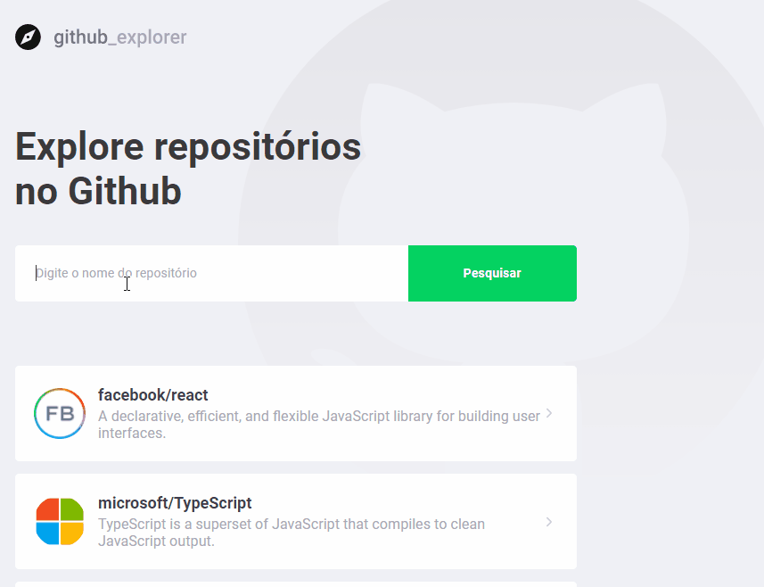

## Prerequisites
- [Yarn package manager](https://classic.yarnpkg.com/en/docs/getting-started)

## Installation

OS X & Linux:

```sh
git clone https://github.com/LulaCrackudo/react-ts.git
cd react-ts
yarn install
```

## Development setup

Server will start at localhost:3000, if the port is available.

```sh
yarn start
```

## Screenshots



